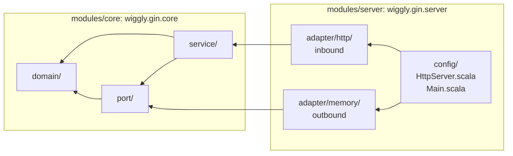

# wiggly-gin

A multiplayer game server for Gin Rummy

The rules of a round are in [the game flow document](docs/GAME-FLOW.md). Where the work goes next
is in [the roadmap](docs/ROADMAP.md).

## Modules

| Module            | Path             | Role                                                   |
| ----------------- | ---------------- | ------------------------------------------------------ |
| `wiggly-gin-core` | `modules/core`   | Domain and ports — pure, no infrastructure             |
| `wiggly-gin-server` | `modules/server` | Driving adapter — exposes the game over HTTP           |

### Where a file goes

The packages are named after the role a file plays in the hexagon, so the role is readable from the
path. The arrows below are dependencies, and every one of them points inward.



The table is the authority on where a file goes. Each path is relative to
`src/main/scala/wiggly/gin/` in the matching module, so `core/domain/` is the full
`modules/core/src/main/scala/wiggly/gin/core/domain/`.

| Path | What goes there |
| --- | --- |
| `core/domain/` | The rules of the game. No `F[_]`, and no library but cats-core. |
| `core/port/` | Traits in `F[_]` that the domain owns, inbound and outbound together. |
| `core/service/` | Drives the domain to satisfy an inbound port. |
| `server/adapter/http/` | Inbound: the routes that call into the application. |
| `server/adapter/memory/` | Outbound: an implementation of a core port. |
| `server/config/` | The runtime shell: configuration read from the environment. |
| `server/HttpServer.scala` | The Ember wiring. |
| `server/Main.scala` | The composition root, the only place that knows every adapter. |

Three rules keep it honest:

1. `core/domain` names no technology. A `GameRepository[F]` trait is domain code; a `Transactor` is
   not.
2. A port is declared in `core/port` and implemented under `server/adapter/<technology>`, which is
   the only place that technology is named.
3. `Main`, `HttpServer` and `config` are not adapters. They are the shell that reads the
   configuration, builds the adapters and runs them. Everything depends on the shell and the shell
   depends on everything, so nothing else may.

`core/port`, `core/service` and `server/adapter/memory` arrive with step 5 of the
[roadmap](docs/ROADMAP.md); the rest of the tree exists today.

Ports are not split into inbound and outbound packages. Which direction a port faces is clear from
who implements it, and there will only ever be a handful.

## Running the server

```bash
sbt server/run
curl http://localhost:8080/health
```

### Configuration

All configuration comes from the environment, with defaults that work unchanged in a container.

| Variable                    | Default      | Meaning                                          |
| --------------------------- | ------------ | ------------------------------------------------ |
| `GIN_HTTP_HOST`             | `0.0.0.0`    | Interface to bind                                |
| `GIN_HTTP_PORT`             | `8080`       | Port to bind                                     |
| `GIN_HTTP_SHUTDOWN_TIMEOUT` | `30 seconds` | Grace period for in-flight requests on shutdown  |
| `GIN_LOG_LEVEL`             | `INFO`       | Root log level                                   |

An unparseable value fails startup rather than silently falling back to the default.

The defaults and the environment variables that override them live in
`modules/server/src/main/resources/application.conf`; they are read with
[pureconfig](https://pureconfig.github.io/).

## Endpoints

| Endpoint   | Purpose                                                          |
| ---------- | ---------------------------------------------------------------- |
| `/health`  | Liveness probe: `200 {"status":"ok"}`                            |
| `/api/v1/` | Prefix under which the game's routes are mounted                 |

Every response carries a JSON body, including `404` and `500`, so a client can parse them all the
same way.

## Tests

```bash
sbt test            # all modules
sbt server/test     # one module
sbt scalafmtAll     # format; scalafmtCheckAll to verify without writing
```

Tests are [weaver](https://typelevel.org/weaver-test/) suites, property-based by default via
`weaver-scalacheck`. Conventions:

- **Suites are objects named `*Suite`**, matching the class each one extends (`SimpleIOSuite`).
- **Generators live in `modules/core/src/test/scala/wiggly/gin/gen/`** and reach other modules
  through the `test->test` dependency in `build.sbt`, so domain generators are written once.
- **Prefer passing an explicit `Gen` to `forall` over an implicit `Arbitrary`.** For a constrained
  domain type there is rarely one obvious distribution — any ten cards, a hand holding melds, and a
  hand at the knock boundary are all "a hand" — and an implicit instance hides which one a test
  actually ran against.
- **Properties for invariants, `pureTest` for rulebook examples.** Specific scoring cases from the
  rules are worth pinning literally rather than deriving.
- **Keep generators narrow.** weaver's checkers do not shrink: a counterexample is reported exactly
  as generated. The failure output does include a seed that reproduces it, e.g.
  `forall.withConfig(checkConfig.withInitialSeed(...))`.

### Coverage

```bash
sbt coverageAll     # report in target/scala-3.9.0/scoverage-report/index.html
```

`coverageAll` is an alias in `build.sbt` for the five steps a report needs:

```
clean; coverage; test; coverageAggregate; coverageOff
```

`clean` is there because instrumented and plain class files in one `target` break incremental
compilation, so any switch between the two kinds of build needs it. `coverageOff` puts the session
back to uninstrumented compilation on the way out.

`coverageAggregate` reports both modules together, and that combined figure is what the build
gates on: below 85% statement or 50% branch coverage the task fails. `Main.scala` and
`HttpServer.scala` are excluded, because they are the composition root and the Ember wiring and no
unit test drives them.
