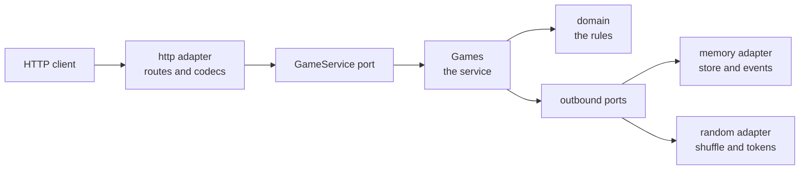
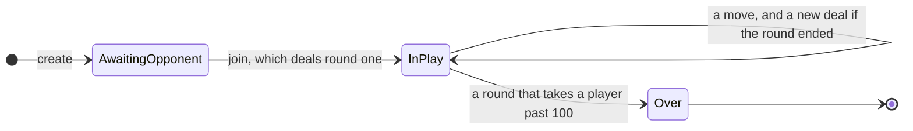

# Design

How this server is built, and why it is built that way.

This document covers the design. The rules of the game are in [the game flow
document](GAME-FLOW.md), which is the one place a rule is written down. The commands you run are
in [the README](../README.md). The wire format is in [`openapi.yaml`](openapi.yaml).

## What the server does

Two people play a match of gin rummy over HTTP. One player creates a game and gets back a token. A
token is a secret string that claims one seat at one game. The other player joins with the game id
and gets a token of their own. The join deals the first round.

From then on each player reads their own view of the game, plays moves, and watches a stream of
updates. The server deals each new round and counts each finished round. When a player reaches 100
points, the match ends.

## The shape of the system

The code follows the hexagonal pattern, which is also called ports and adapters. The pattern puts
the rules of the game in the middle, with no knowledge of HTTP, of storage, or of time. Everything
that talks to the outside world sits at the edge, behind an interface the middle defines.



The middle is the `core` module. It holds the domain and the ports, it is pure, and it names no
technology at all. The `server` module holds every adapter and the `main` method. Dependencies
point inward only. The README has the directory layout and the rule for where a new file goes.

The gain is that a choice of technology is a choice you can revisit. A WebSocket adapter is a new
file beside the event stream rather than a change to the rules. A database store is a second
implementation of one interface.

## The idea that runs through all of it

Make invalid states unrepresentable. Reach for a type that cannot hold a value the rules forbid.
The alternative is a type that can hold one, plus a check somewhere else that catches it.

In practice this means a private constructor and a smart constructor that returns `Option`. A
smart constructor is a function that refuses to build an illegal value. `Meld.Set.from` and
`Meld.Run.from` are the pattern. Nothing downstream re-checks a meld it receives, because nothing
downstream can receive anything else.

Where a type cannot carry the rule, the code makes sure of it once. The check goes at the boundary
the value enters through, and every function past that point is total. A total function is one
that returns an answer for every input it accepts. `Deck.from` is the boundary for the 52 cards,
so `deal` never has to ask whether its deck is a real deck.

Some rules span several fields, so no single type can hold them. "These four piles together are
exactly one deck" is one of them. Rules of that kind are stated as properties in the tests instead
of as checks scattered through the code.

## Cards, melds and the deadwood search

`Rank` carries two different numbers, and keeping them apart matters.

| Number | What it is | Values |
| --- | --- | --- |
| `order` | The position in a run. The ace is low and runs do not wrap. | A=1 up to K=13 |
| `deadwoodValue` | What the card costs its holder at the end of a round. | A=1, 2 to 10 pip, J/Q/K=10 |

`Deck` has a private constructor. `Deck.from` sorts the cards it is given. It returns `Some` for a
list that sorts back into the ordered 52, and `None` for anything else. One comparison rejects a
repeated card, a short deck and a foreign card together.

A `Meld` is a set or a run. A set is three or four cards of one rank. A run is three or more cards
in sequence in one suit. Each kind stores its cards in canonical order rather than a compact
description such as `Run(suit, lowest, length)`. The cards are what every consumer wants, layoffs
included.

`Arrangement.best` finds the arrangement of a hand that leaves the fewest points of deadwood. This
is the only hard algorithm in the game, because a card can belong to two different melds and the
search has to choose. It works in two stages.

First it enumerates every valid meld that is a subset of the hand. For runs it emits every window
of length three or more inside each consecutive stretch, not only the longest one. That detail is
the whole correctness of the stage. Given `4D 5D 6D 7D 7H 7C`, the longest run `4D-7D` leaves
`7H 7C` for 14 points, while `4D 5D 6D` plus the set `7D 7H 7C` is gin.

Second it recurses over the candidates in a fixed order, taking or skipping each one, and keeps
the selection that melds the most value. A hand holds ten or eleven cards, so the search is small.
Ties resolve to whichever selection the canonical order reaches first. That tie-break is part of
the contract, because it is what makes the answer deterministic and therefore assertable in a
test.

The approach here is deliberate. A correct slow version beats a clever wrong one. If a profile
ever asks for speed, memoisation on the pair of candidate index and remaining cards is the escape
hatch.

## The round as a state machine

A round is a value of `GameState`, which splits into `InProgress` and `Finished`. The split falls
where the machine splits. A finished round has no player on turn, and the type says so, which
turns a guard repeated in every branch into one `Left(RoundOver)`.

`InProgress` carries a `Table` of the stock, the discard pile and both hands, the `Seats` that say
who dealt, and a `Phase`. There are four live phases: `UpcardOffered`, `AwaitingOpeningDraw`,
`AwaitingDraw` and `AwaitingDiscard`. Only `AwaitingDiscard` carries the card its player took from
the discard pile. One rule reads that card and no other rule does. The rule is that a player
cannot discard the same card again on the same turn.

One pure total function applies a move:

```scala
def apply(state: GameState, player: Player, move: Move): Either[GameError, GameState]
```

A rejected move returns a `GameError` and the caller still holds the state it started with. An
illegal move therefore cannot leave a round part-way through a change.

[GAME-FLOW.md](GAME-FLOW.md) holds the five states, the five moves, every transition and the ten
guards with the error each one returns. It is the authority, and nothing here repeats it.

Three design choices in this area are worth naming.

Gin is a knock worth nothing, not a move of its own. One move and one guard cannot come to
disagree about a hand of zero deadwood. Two of each can.

A layoff is computed with the score rather than played out as a move. A layoff only ever cuts
deadwood, so no player declines one. The round therefore needs no phase in which to offer it.

Shuffling is not in the domain. `deal` takes a deck that is already shuffled. A test therefore
deals a deck it wrote by hand, and the effect stays at the edge of the application.

`Hand.remove` returns `Option` and takes out one copy rather than every copy. A hand is not a set,
deliberately. The failure that matters is a card in two places at once, and a set cannot see that
one. A set also turns adding a held card into a silent no-op, which trades a visible duplicate for
an invisible loss. The `Deck` boundary and a conservation property in the tests carry the
guarantee instead.

## Scoring

A defender wants every card either melded or laid off, because both cost nothing. Doing that in
two passes can go wrong, and the failing case is worth stating.

Take a knocker who lays down the run `7S 8S 9S` against a defender holding `10S 10H 10D` and `JS`.
The best arrangement of the defender's hand on its own is the set of tens, which leaves `JS` as
deadwood. `JS` cannot then reach the knocker's run, because a run is contiguous and the only card
that joins `JS` to it is `10S`. The set has taken `10S`. That card is a bridge, and a first pass
that does not know what a bridge is for can spend one.

`Defence.against` therefore runs one search over both kinds of candidate at once. The candidates
are the defender's own melds and the groups of cards that go onto a meld of the knocker's. The
search that `Arrangement` already uses takes a function to read a candidate's cards, so the same
code serves both. A `Defence` holds three lists: own melds, cards laid off, and deadwood. A
laid-off card belongs in none of an `Arrangement`'s two lists, which is why `Defence` is a
separate type.

`RoundScore` has four cases: `Dead`, `Knock`, `Gin` and `Undercut`. The match counts rounds won,
so a dead round must not count as one. Naming the three ways of winning also makes a test read as
the rule it pins rather than as a suspicious 25.

Gin resolves before any `Defence` is built. That is how the rule "gin blocks layoffs" becomes an
order of evaluation instead of a flag. `RoundResult.of` states it in one expression: a defender
who faces gin is `Defence.against(hand, Nil)`, which is a defender with nothing to lay off onto.

## The match ledger

A `Match` is a ledger rather than a machine that owns the round. It stores two things: the seats
the first round was dealt with, and the list of round scores with the most recent first. Every
other figure is arithmetic over those two.

| Figure | How it is derived |
| --- | --- |
| Each player's total | The sum of the scores that player won. |
| Rounds won | The count of the scores that player won. |
| Who deals next | The opening dealer, passed once for every round that scored. |

A stored total is a second copy of a number the history already holds, and two copies can
disagree. A dead round passes the deal to nobody. That rule is then a fact about the list, not a
field somebody has to remember to update.

`Match` splits into `InProgress` and `Finished` with private constructors, for the same reason
`GameState` does. A finished match has nobody dealing next and no round to play. `start` and
`played` are the only doors, so a `Finished` can only come from a total that crossed the target.

These are the numbers, and this table is the authority for them.

| Constant | Value |
| --- | --- |
| Target to win the match | 100 |
| Gin bonus | 25 |
| Undercut bonus | 25 |
| Game bonus to the winner | 100 |
| Box bonus, per round a player won | 25 |
| Shutout | If the loser finished on nothing, the winner's figure doubles. |

The shutout never has to argue with a box bonus the loser earned. Every way of winning a round is
worth at least one point, so a loser on nothing is a loser who won no rounds.

## A game, which is a match plus a round

`Game` is what the application stores. It has three cases.

| Case | What it holds |
| --- | --- |
| `AwaitingOpponent` | The id and the host's token. The second seat is empty. |
| `InPlay` | The tokens, the ledger, the round in play, and an optional previous round. |
| `Over` | The tokens, the finished ledger, and the round that ended the match. |

The invariant worth naming: a stored game never holds a finished round. The moment a round ends,
the server scores it and folds it into the ledger. Then it deals the next round, or the match is
over and there is no round to hold. This is why `InPlay` names `GameState.InProgress` rather than
`GameState`, and it is what makes every route past the token guard total.



Two functions move a game on, and both take a deck, because both can deal one.

```scala
def joined(guest: Token, deck: Deck): Either[GameFault, Game]
def played(player: Player, move: Move, next: Deck): Either[GameFault, Game]
```

`Games` shuffles a deck before every update, whether or not the move ends a round, and `played`
discards the one it does not need. That is the price of an update the store applies in one
indivisible step. A wasted shuffle of 52 cards is the cheapest way to pay it.

A `GameFault` is the game refusing a request, which is separate from a `GameError`, the rules
refusing a move. The faults are `NoSuchGame`, `NotAPlayer`, `AlreadyFull`, `NotInPlay` and
`Illegal`. `Illegal` carries the rules' own error inside it rather than restating it.

## The redacted view

A player must never see the other hand or the order of the stock. The design puts that guarantee
in the shape of a type rather than in a filter somebody has to remember to apply.

`PlayerView` is a separate enum and never a `GameState`. Its `InPlay` case has no field able to
hold the other hand or the stock. The opponent is a count and the stock is a count. The discard
pile is a count plus its top card, because a pile is squared at a real table.

Neither `Game` nor `GameState` has a JSON encoder at all. A type with no encoder cannot reach a
client, so the only shape a game leaves the application in is a `PlayerView`. A leak therefore has
to be a new field that somebody adds, not a guard that somebody forgets.

The view carries the requester's own cards as an `Arrangement`, which is what tells them whether
they can knock. It carries `onTurn` as a resolved player, because `AwaitingOpeningDraw` names
nobody and working that out needs the seating. It carries `phase` unredacted, which is safe on
inspection: the only card a phase names is the one its own subject took from the pile, in the
open.

`RedactionSuite` in the server module is the test that holds this. It plays a game, encodes each
player's view, and collects every card-shaped object anywhere in the JSON. Those cards must be a
subset of what that player is entitled to see. The test reads the encoded payload rather than the
Scala value. A field added later is therefore covered, whether or not anybody remembers the suite
exists.

The claims about the stock are made with `previous` set aside, which is a correction the design
needed once the test ran. A knock puts both hands on the table. The next deal shuffles those cards
back in, so they turn up in the stock of the round now in play. They say nothing about where
anything is now, and the version of the claim that keeps `previous` in is false.

## The ports

There are five. `GameService` is the inbound port that the HTTP layer drives. The other four are
outbound ports that the adapters satisfy.

| Port | What it is for | Who satisfies it |
| --- | --- | --- |
| `GameService` | Create, join, look, play, watch. The only way in. | `Games` in `core/service` |
| `GameRepository` | Where games are kept. | `MemoryGameRepository` |
| `GameEvents` | How a player finds out that the other one moved. | `MemoryGameEvents` |
| `Shuffler` | A deck in an order nobody chose. | `RandomShuffler` |
| `Secrets` | Game ids and tokens nobody can guess. | `RandomSecrets` |

`GameRepository.update` takes a change rather than a game:

```scala
def update(id: GameId)(change: Game => Either[GameFault, Game]): F[Either[GameFault, Game]]
```

Reading, changing and writing are then one step the store makes indivisible. Two moves that arrive
together queue behind each other, instead of one overwriting the other. A caller that reads and
then writes cannot be written by mistake. The change is pure because that is what a `Ref` can
apply atomically. An effectful change needs a lock held across an effect, or a second write that
other requests can see in between.

`Games` is the code behind `GameService`. It resolves a token to a player, calls the domain
function, writes the result through `update`, and publishes it. What it returns is the mover's own
view of what they did. A client therefore needs no second request to see the result of its own
move. Creating and joining publish as well, because a host waiting on the stream wants to know
that the game started.

## The adapters

`MemoryGameRepository` is a `Ref` holding a map from game id to game, and `update` is one
`modify`. Its test for that is a race for the second seat: a hundred joins fired at once against
one waiting game leave exactly one that succeeded and ninety-nine refused with `AlreadyFull`. A
store that reads and then writes seats several.

`MemoryGameEvents` holds one `SignallingRef` per game. It is a signal rather than a topic. An
event is a whole game, so a watcher who falls behind wants the state as it now is, not the states
it missed. A signal also holds the current value, so a watcher is handed the game as it stands and
then every state after it. There is no window between asking and listening for a move to slip
through, and no subscribe-then-read dance to get right.

`RandomSecrets` draws from `Random.javaSecuritySecureRandom`, because a token that can be guessed
is not a token. `RandomShuffler` draws from an ordinary `Random`, because a shuffle has to be
unrepeatable rather than unguessable. It rebuilds the result through `Deck.from`, so a bad shuffle
fails loudly.

The HTTP adapter holds the routes and the codecs. The routes and their payloads are in
[`openapi.yaml`](openapi.yaml), and the README lists them. A fault becomes a status:

| Fault | Status |
| --- | --- |
| `NoSuchGame` | 404 |
| `NotAPlayer` | 403 |
| `AlreadyFull` | 409 |
| `NotInPlay` | 409 |
| `Illegal(error)` | 422, with the rule's own name in the body |
| No token at all | 401, which the service is never asked about |
| A body that is not a move | 400, for the same reason |

The codecs derive every case class and are written by hand only where derivation gets the shape
wrong for an API. That happens in three places. A plain enum derives to `{"Ace":{}}` where a
client wants `"ace"`. A sum derives to `{"UpcardOffered":{...}}` where a client wants a tag beside
the fields. A single-field wrapper derives to `{"value":"..."}` where a client wants the string.

When somebody adds a field, a derived product stays right. A hand-written encoder does not.

## Transport and identity

The transport is REST for the moves and server-sent events for the state. A move is a POST with a
body and a reply, so duplex framing buys nothing. The only push a client needs is "the state
changed, here is your view". Server-sent events are an ordinary GET, they pass through proxies,
and browsers reconnect on their own. The stream carries a comment heartbeat on an interval,
because a proxy drops an idle connection.

Identity is an opaque token per seat, minted from a secure source and stored with the game. There
is no secret to configure and no key to rotate, and a leaked token is withdrawn by forgetting it.
A request carries the token as a bearer token. The stream also accepts it as a query parameter,
because the browser `EventSource` API cannot set a header.

The host is always `Player.One`, and the player who joins deals the first round. This removes a
field from the waiting state and a random choice from the join. The one who waited gets the first
offer of the upcard in exchange, and the deal alternates from then on.

Identity in the larger sense is open. A token says which seat is asking and nothing about who
holds it. There are no accounts, nothing stops a host joining their own game, and anybody who
learns a game id can take the second seat. None of that makes the redaction weaker than it claims
to be.

## The container and the pipeline

`sbt server/Docker/publishLocal` builds the image through sbt-native-packager. The base is
`eclipse-temurin:25-jre`, which is the JDK the project builds on, as a runtime. That is 490MB
against the 306MB of the Alpine variant. The size was a deliberate trade for glibc rather than
musl, which is the same C library as the machine anybody debugs on.

The process runs as uid 1001 and exposes the port that `application.conf` already defaults to. The
start script carries `-XX:MaxRAMPercentage=75`. Unless you state the heap in percentage terms, a
JVM in a container sizes it from the host's memory rather than from the container limit. That is
the wrong number, and it is wrong silently. `JAVA_OPTS` still overrides the flag.

Nothing about the running process is decided at build time. The process reads every setting from
the environment, so one image serves every environment. A new setting is a line in
`application.conf` rather than a new image. The image carries no `HEALTHCHECK`: `/health` is there
and documented, and an orchestrator defines its own probe. Baking a check into the image means
adding a package for the sole purpose of making an HTTP request.

`.github/workflows/ci.yml` runs on pushes to `main` and on every pull request. It runs the gate,
then the coverage floors, then builds the image, then starts it. The last of those is the one
worth having, because it is what stops the packaging producing something that builds and cannot
run. The gate step is the same line `CLAUDE.md` asks a person to run, character for character. The
file and the pipeline therefore cannot disagree about what the gate is. A second job lints
`openapi.yaml` with redocly, beside the gate rather than after it, because it needs Node rather
than a JVM.

Nothing is published to a registry. That leaves no credentials to hold and no tagging scheme to
invent before anybody needs one.

## What is deliberately absent

Each of these is a decision rather than an oversight.

- No image signing, no SBOM and no vulnerability scan. All three are claims about an artefact
  somebody else pulls, and nobody pulls this one yet.
- No release versioning and no multi-architecture build. Both are part of deciding to publish.
- No lobby. There is no listing of games, no matchmaking, and no way to find a game you were not
  told the id of.
- No CORS, no rate limit and no request id. Each of the three is middleware in `GinApi`, and
  nobody needs one yet.
- No WebSocket. It is an adapter over `GameEvents` beside the stream, which is why the broker went
  behind a port rather than into the routes.
- No bonus that depends on the shape of a match rather than its score. The three bonuses above are
  the ones the game is normally played with.

Two known costs come with the in-memory store. A game and a token both last only as long as the
process does. A signal is never removed once it is made, so a long-lived process accumulates one
map entry per game played. Both are fixed by the persistent store below, where the end of a game
has somewhere to be recorded.

## What comes later

- A persistent `GameRepository` adapter, once the in-memory one is outgrown. It is the same port, so
  nothing above it changes.
- A WebSocket adapter over `GameEvents`, for a client that wants one connection for everything.
- A lobby, with the accounts that making one useful implies.
- Middleware in `GinApi` for CORS, rate limiting and a request id.
- Publishing the image to a registry, with the tagging, signing and scanning that publishing an
  artefact for somebody else to pull implies.
