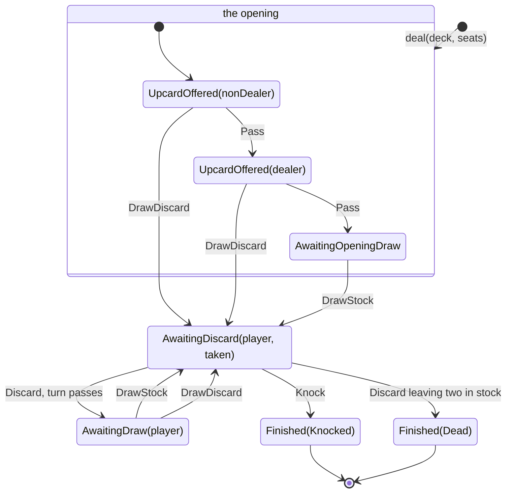
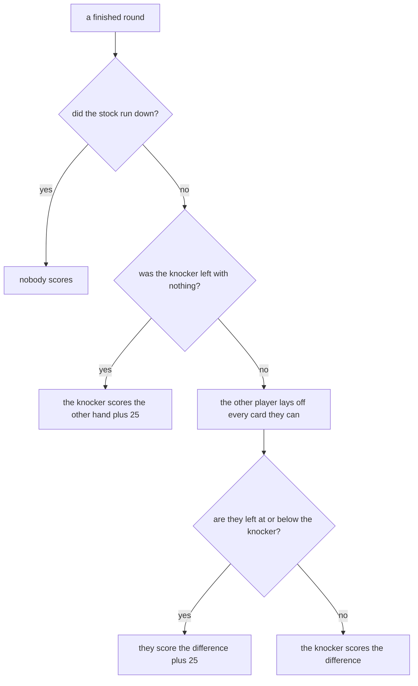

# Game flow

This document describes one round of gin rummy as a state machine. A state machine is a fixed set
of states with named moves between them. It is the rules reference for the `core` domain, and the
working plans for [the state machine](PLAN-STATE-MACHINE.md) and [scoring](PLAN-SCORING.md) point
here for every rule so that each rule is written once.

The round is the unit this document covers. A match is a sequence of rounds. The last two sections
cover what a round is worth and how the rounds add up.

## Terms

| Term | Meaning |
| --- | --- |
| stock | The face-down pile that players draw from. |
| discard pile | The face-up pile of cards that players have thrown away. |
| upcard | The top card of the discard pile. |
| set | Three or four cards of one rank. |
| run | Three or more cards in sequence in one suit. |
| meld | A set or a run. Melded cards cost their holder nothing. |
| deadwood | The cards a hand cannot meld, and the points they cost. |
| knock | To end the round with ten or less deadwood. |
| gin | A knock with no deadwood at all. |
| layoff | A card added to the knocker's meld to cut deadwood. |
| undercut | The opponent ends with deadwood at or below the knocker's. |
| dead round | A round that ends with no score for either player. |
| box | A round won, which is worth a bonus once the match is over. |
| shutout | A match the loser finished with no points at all. |

## The deal

The deal gives each player ten cards. The next card goes face up and starts the discard pile. The
remaining 31 cards form the stock. One player is the dealer and the other is the non-dealer.

A deck is all 52 cards, each of them once. The domain makes that a property of the type rather
than a thing to check, so a round cannot start from a deck that repeats a card or is short of one.
Every move after the deal moves a card from one place to another and never makes one, so the four
places together stay the deck for as long as the round lasts.

The deal takes the seating as well as the deck, because the seating is what says which of the two
players dealt. Nothing in a round reads it except the opening, and nothing in a round changes it.

The deal takes a deck that is already shuffled. A shuffle is an effect, so it stays outside the
domain. Step 5 of the [roadmap](ROADMAP.md) adds the port that supplies a shuffled deck. Until
then a test deals a deck it wrote by hand, and the round that comes back is legal by construction.

## The states

There are five states. The count of cards a player holds is part of the state rather than a thing
to check, because a player holds ten cards between turns and eleven in the middle of one.

| State | Meaning | On turn holds |
| --- | --- | --- |
| `UpcardOffered(player)` | The player can take the upcard or pass. | 10 |
| `AwaitingOpeningDraw` | Both players passed. The non-dealer must draw from the stock. | 10 |
| `AwaitingDraw(player)` | The player must draw from the stock or from the discard pile. | 10 |
| `AwaitingDiscard(player, taken)` | The player drew and must now discard. | 11 |
| `Finished(outcome)` | The round is over. No move is legal. | none |

`taken` holds the card the player took from the discard pile this turn, if the player took one. It
exists because of one rule, stated under Guards below: a player cannot discard that card again on
the same turn.

## The moves

There are five moves.

| Move | Meaning |
| --- | --- |
| `DrawStock` | Take the top card of the stock. |
| `DrawDiscard` | Take the upcard. |
| `Pass` | Decline the upcard at the start of the round. |
| `Discard(card)` | Put a card face up on the discard pile. |
| `Knock(card)` | Discard that card and end the round. |

Taking the upcard at the start of the round and drawing from the pile on a later turn are the same
act, so `DrawDiscard` covers both. `Pass` is legal only while the upcard is on offer.

One pure total function applies a move:

```
(state, player, move) => Either[GameError, GameState]
```

A rejected move returns a `GameError` and the caller still holds the state it started with, so an
illegal move can never leave the round part-way through a change.

## Transitions



The three opening states are boxed together because a round passes through them once. Everything
outside the box is the cycle a round spends the rest of its life in.

| From | Move | Goes to |
| --- | --- | --- |
| `UpcardOffered(p)` | `DrawDiscard` | `AwaitingDiscard(p, taken = upcard)` |
| `UpcardOffered(nonDealer)` | `Pass` | `UpcardOffered(dealer)` |
| `UpcardOffered(dealer)` | `Pass` | `AwaitingOpeningDraw` |
| `AwaitingOpeningDraw` | `DrawStock` | `AwaitingDiscard(nonDealer, taken = none)` |
| `AwaitingDraw(p)` | `DrawStock` | `AwaitingDiscard(p, taken = none)` |
| `AwaitingDraw(p)` | `DrawDiscard` | `AwaitingDiscard(p, taken = upcard)` |
| `AwaitingDiscard(p, _)` | `Discard(c)` | `AwaitingDraw(other p)`, or `Finished(Dead)` |
| `AwaitingDiscard(p, _)` | `Knock(c)` | `Finished(Knocked(p))` |

### The opening

The rules of gin rummy start a round with an offer rather than a turn. The non-dealer can take the
upcard or pass. If the non-dealer passes, the dealer gets the same offer. If both players pass, the
non-dealer draws from the stock, and only from the stock, because the non-dealer has just refused
the upcard.

A player who takes the upcard holds eleven cards and discards next, exactly as in a normal turn. A
knock is legal there too, so a round can end on its first move.

The discard pile is empty between the take and the discard that follows it. That is the only point
in a round where it holds no cards.

### The end of the stock

A discard that leaves two cards in the stock ends the round as a dead round. Nobody scores and the
cards are dealt again. The rule falls on the discard rather than on a draw, so `AwaitingDraw` with
a two-card stock is a state the round never reaches.

A knock on that same discard is still legal, so the last player to draw keeps the chance to end the
round with a score.

## Guards

The states above carry most of the rules. Ten guards carry the rest, and each one names the error
it returns.

| Rule | Error |
| --- | --- |
| Only the player on turn can move. | `NotYourTurn` |
| A player must draw before discarding. | `MustDraw` |
| A player must discard after drawing. | `MustDiscard` |
| `Pass` needs an upcard on offer. | `NothingToPass` |
| The opening draw must come from the stock. | `PileClosed` |
| The stock stays closed while the upcard is on offer. | `StockClosed` |
| A discarded card must be in the player's hand. | `CardNotHeld` |
| A player cannot discard the card just taken from the pile. | `CannotDiscardDrawnCard` |
| A knock needs ten or less deadwood after the discard. | `CannotKnock` |
| A finished round accepts no move. | `RoundOver` |

The player on turn is the player the state names. `AwaitingOpeningDraw` names nobody because it is
always the non-dealer's, and a move there by the dealer returns `NotYourTurn` like any other.

`MustDraw` means that the player has not taken a card yet this turn, so it answers a discard or a
knock in any of the three states before `AwaitingDiscard`. `MustDiscard` answers a draw once the
player holds eleven cards. A pass in any state but `UpcardOffered` returns `NothingToPass`, the
opening draw included, because both players have already had the offer by then.

`PileClosed` and `StockClosed` are a pair, and each one names the source that is shut. A player
cannot reach the stock while the upcard is still on offer, and a player who has just refused the
upcard cannot then take it.

`CannotDiscardDrawnCard` applies to `Knock` as much as to `Discard`, because a knock discards a
card. `CannotKnock` measures the ten cards that remain after the discard, not the eleven in hand.

## Outcomes

A round finishes in one of two ways.

`Knocked(player)` records who knocked. The finished state keeps both hands, so scoring reads the
round rather than replaying it.

`Dead` records that the stock ran out. Neither player scores.

Gin is not a separate outcome. A knocker whose deadwood is zero has gin, and the finished state
says so by holding the arrangement that proves it. That keeps one move and one guard where two
would otherwise disagree about a hand worth nothing.

### Layoffs

Every layoff that a hand can make is made. The opponent chooses nothing, because a layoff can only
cut deadwood and never adds to it, so a player who declined one would only lose points.

Gin blocks layoffs. A player who faces gin scores their deadwood in full.

A card laid onto a run has to be contiguous with it, as any card in a run does. Laying off the card
two ranks past the end of a run therefore means laying off the card in between as well, and a player
who cannot reach a run has nothing to put on it.

An undercut is an outcome of the arithmetic rather than a state of the round. Scoring compares the
two deadwood totals after layoffs and awards the points.

## Scoring

A finished round is worth points to one player or to neither. This table is the authority.

| The round ended | Who scores | What they score |
| --- | --- | --- |
| The stock ran down | Neither | Nothing, and the cards are dealt again. |
| A knock, the knocker left with nothing | The knocker | The other hand in full, plus 25. No layoffs. |
| A knock, the other player left above the knocker | The knocker | The difference between the two hands. |
| A knock, the other player left at or below the knocker | The other player | The difference, plus 25. |



Gin is settled before any layoff is worked out, which is the whole of the rule that gin blocks
them. An undercut at equal deadwood scores nothing for the difference and the bonus on top.

## The match

Rounds accumulate to a target of 100 points. The deal passes to the other player after each round
that scores. A dead round is dealt again by the same dealer.

Three questions were open at this level. These are the answers.

A match is a ledger rather than a machine that owns the round. It holds the seating the first round
was dealt with and the rounds played since, and the totals, the rounds each player won and who
deals next are all arithmetic over that list. Whoever holds a game deals each round with the
seating the ledger gives and plays the score back in when the round ends.

A match records every round it played. It has to, because the box bonus counts the rounds a player
won.

Three bonuses apply, and only once a player has reached the target.

| Bonus | What it is worth |
| --- | --- |
| The game | 100 to the winner. |
| A box | 25 to each player for every round that player won. |
| A shutout | The winner's figure doubles if the other player finished on nothing. |

Winning a round is always worth at least a point, so a player who finished on nothing won no rounds
and has no boxes, and the shutout never has to argue with one.

Nothing in the round above depends on any of this.
